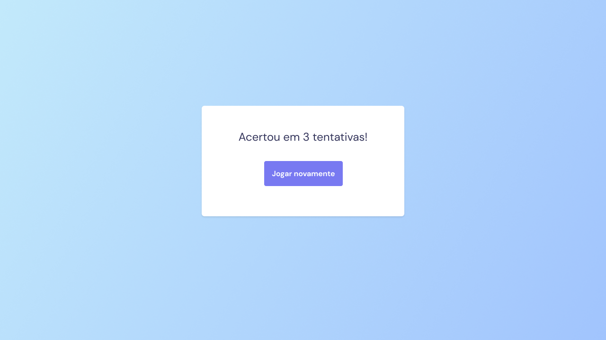

<h1 align="center"> Jogo da adivinhação </h1>

Programa promovido no nível 5 da trilha Explorer da Rocketseat para ensino de tecnologias WEB. 

- [Acesse o projeto finalizado, online](https://bernardosa01.github.io//)
  

  <a href="#-tecnologias">Tecnologias</a>&nbsp;&nbsp;&nbsp;|&nbsp;&nbsp;&nbsp;
  <a href="#-projeto">Projeto</a>&nbsp;&nbsp;&nbsp;|&nbsp;&nbsp;&nbsp;
  <a href="#-layout">Layout</a>&nbsp;&nbsp;&nbsp;|&nbsp;&nbsp;&nbsp;
  <a href="#memo-licença">Licença</a>

  

 

  

  

## 🚀 Tecnologias

Esse projeto foi desenvolvido com as seguintes tecnologias:

- HTML
- CSS
- JavaScript
- Figma

## 💻 Projeto

- 
A aplicação consiste em um jogo de adivinhação, onde o usuário, ao digitar um número entre 0 e 10, tenta adivinhar qual foi o número gerado aleatoriamente pelo sistema. Ao acertar, a aplicação informa quantas tentativas o usuário precisou até o acerto, e dá a opção de reiniciar o jogo.    

- 
 Neste projeto, apliquei o aprendizado absorvido sobre vários temas, destacando-se:  

&nbsp;- Estrutura de dados HTML 
&nbsp;- Variáveis CSS 
&nbsp;- Funções JavaScript 
&nbsp;- Manipulação da DOM 
&nbsp;- Biblioteca JS Math() 

## 🔖 Layout

Você pode visualizar o layout do projeto através [DESSE LINK](https://www.figma.com/file/xYlUu9dhN1pjH12eboj826/Jogo-Adivinha%C3%A7%C3%A3o-Copy?fuid=1267229948111116557). É necessário ter conta no [Figma](https://figma.com) para acessá-lo.

## :memo: Licença

Esse projeto está sob a licença MIT.

---

Feito por Bernardo Sá :wave: [Participe da comunidade da Rocketseat!](https://discord.gg/rocketseat)